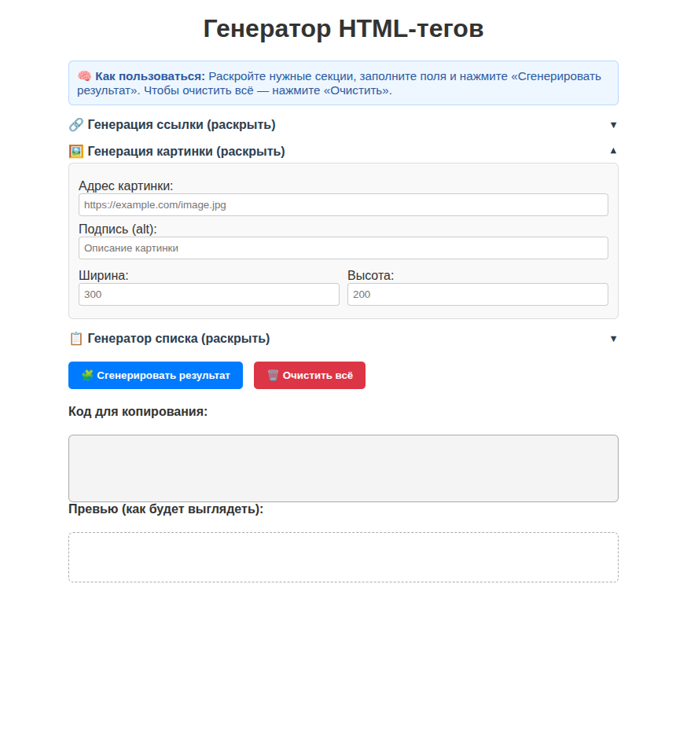
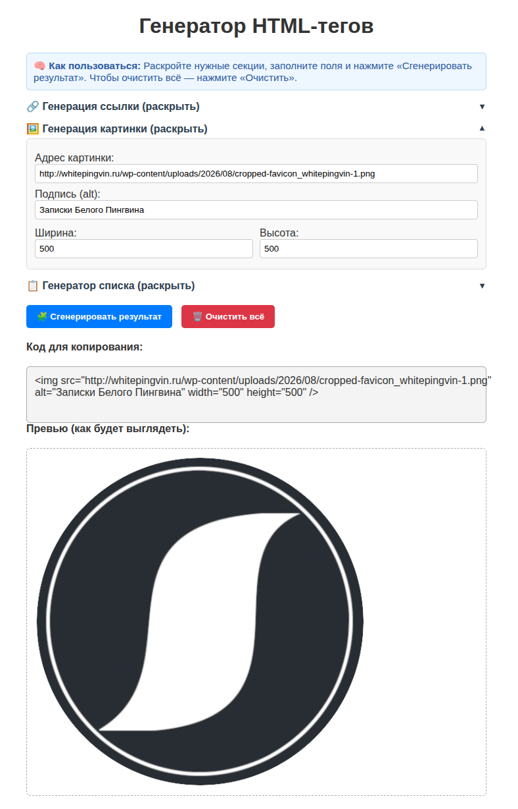

# HTML Tag Generator

Мини-инструмент, чтобы быстро генерировать HTML-разметку для постов, галерей и карточек товаров — без глубокого знания HTML.

## Зачем это нужно

- **Экономит время:** 1–2 минуты вместо 10–15 на сборку простой разметки.
- **Не нужно помнить атрибуты:** инструмент сам подставляет базовые теги и атрибуты.
- **Работает в браузере:** просто открываешь index.html — и сразу можно пользоваться.

## Для кого

- блогеры и авторы постов (ВКонтакте, Рутуб);
- художники и иллюстраторы, которым нужно оформить галерею работ;
- те, кто верстает страницы под свои арты и посты.

## Примеры использования

- галерея из картинок с подписями;
- карточки товаров/работ с кнопкой;
- разметка для вставки в WordPress или конструктор сайтов.

## Как запустить

1. Скачайте репозиторий или откройте `index.html` в браузере.
2. Введите названия тегов, выберите формат вывода, нажмите «Сгенерировать» и скопируйте результат.

## Скриншоты

  


> Скриншоты лежат в папке `screenshots`. Если вы скачиваете только `index.html`, просто откройте его в браузере — интерфейс минималистичный и понятный.

## Лицензия и условия

Скрипт распространяется как готовый инструмент.  
Для коммерческого использования, доработки под задачи и продажи решений — свяжитесь со мной:  
- ВКонтакте: [https://vk.ru/viktorsuver]  
- Telegram: [@suvernet]  
- Почта: [suvernet@yandex.ru]

Готов доработать функционал под ваши задачи (добавить теги, экспорт в WXR, адаптацию под CMS).

Проект не требует установки зависимостей — это чистый HTML/JS.

1. Клонируй репозиторий:
   ```bash
   git clone https://github.com/suvernet/HTML-Tag-Generator.git
